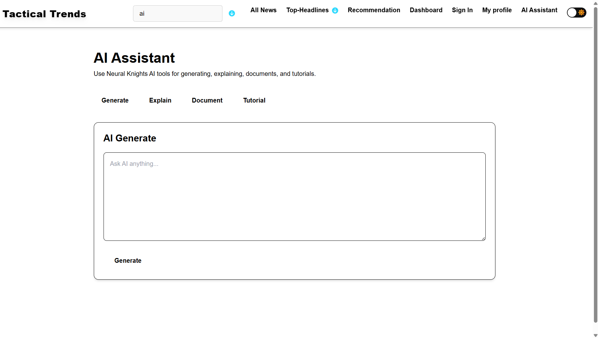
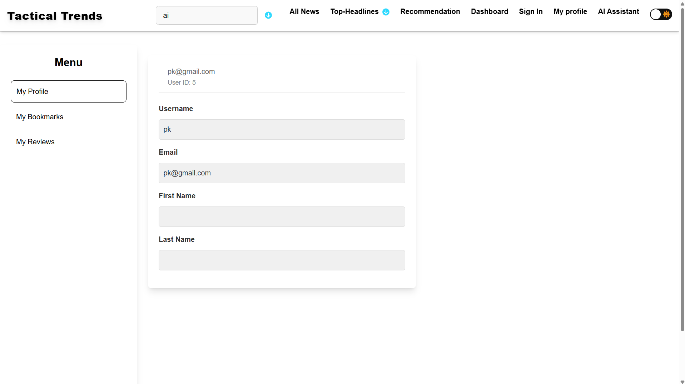
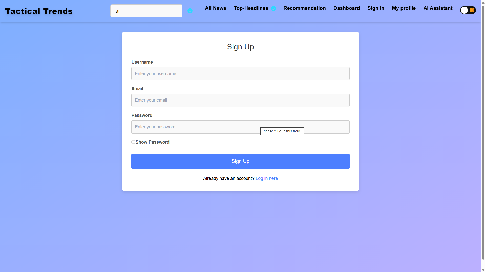
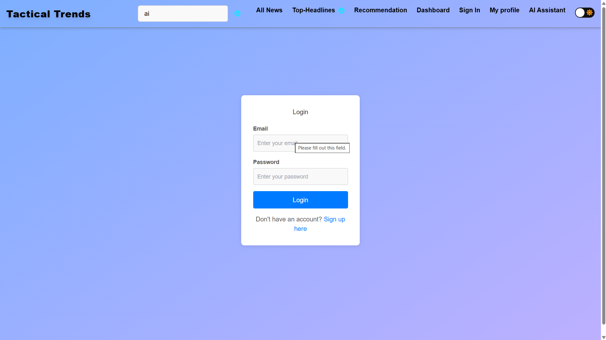
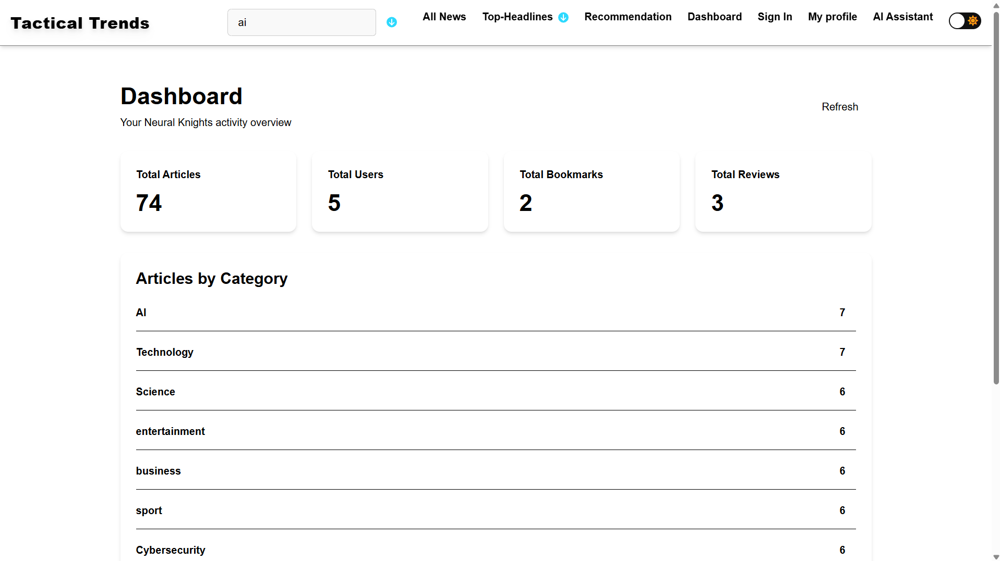

# 🧠 NeuroBrief

> **AI-powered news intelligence platform built by Aniketa Agvane.**

NeuroBrief is a modern news discovery platform that helps users find relevant articles, explore top headlines, search news, manage bookmarks and reviews, and interact with an integrated AI Assistant.

The project is split into a **React/Vite frontend** and an **ASP.NET Core Web API backend**.

### 🔗 Project Links

- **Frontend:** https://github.com/aniketagvane3232/NeuroBrief
- **Backend:** https://github.com/aniketagvane3232/NeuroBrief-Backend
- **Live Frontend:** https://neuro-brief-pi.vercel.app/

---

## ✨ Features

- 📰 **All News & Top Headlines** — browse news articles in a clean card-based interface.
- 🔎 **AI-powered / semantic search** — search for relevant news and view ranked results.
- 🤖 **AI Assistant** — Generate, Explain, Document and Tutorial modes.
- 👤 **Authentication** — Sign Up and Login flows with JWT-based authentication.
- 📊 **Personal Dashboard** — view article, user, bookmark and review statistics.
- 🔖 **Bookmarks** — save articles for later.
- ⭐ **Reviews** — write and manage article reviews.
- 👤 **Profile Management** — manage account/profile information.
- 🌙 **Dark / Light Mode** — switch the interface theme.
- 📱 **Responsive UI** — designed for desktop and smaller screens.

---

## 🛠️ Tech Stack

### Frontend

- React 18
- Vite
- Tailwind CSS
- React Router
- Redux Toolkit / React Redux
- Axios
- Font Awesome

### Backend

- ASP.NET Core Web API
- .NET 8
- Entity Framework Core
- PostgreSQL
- Npgsql
- JWT Authentication
- Swagger / OpenAPI
- BCrypt
- Google Gemini integration
- Embedding and article-analysis services

The backend repository contains controllers, DTOs, models, data access, migrations and services for the application. 

---

## 🏗️ Architecture

The overall request flow is:

**User → React Frontend → ASP.NET Core API → PostgreSQL / AI Services**


### Main Components

| Component | Responsibility |
|---|---|
| **React + Vite** | User interface and client-side application |
| **Axios** | HTTP communication with the backend |
| **ASP.NET Core API** | Authentication, business logic and REST endpoints |
| **Entity Framework Core** | Database access and migrations |
| **PostgreSQL / Neon** | Persistent application data |
| **JWT** | Secure authentication and authorization |
| **Gemini** | AI assistance, embeddings and article intelligence |
| **Swagger** | API documentation and testing |

---

## 📸 Screenshots

### 🤖 AI Assistant

<p align="center">
  
</p>

### 👤 Profile

<p align="center">
  
</p>

### 🔐 Authentication

<table>
  <tr>
    <td width="50%"></td>
    <td width="50%"></td>
  </tr>
</table>

### 📊 Dashboard

<p align="center">
  
</p>

### 🔎 Search Results

<table>
  <tr>
    <td width="50%"></td>
    <td width="50%"></td>
  </tr>
</table>

---

## 🚀 Getting Started

### Prerequisites

Make sure you have:

- Node.js and npm
- .NET 8 SDK
- PostgreSQL / Neon PostgreSQL
- A Google Gemini API key if you want to use the AI features

---

## 1. Clone the Frontend

```bash
git clone https://github.com/aniketagvane3232/NeuroBrief.git
cd NeuroBrief
```

## 2. Install Frontend Dependencies

```bash
npm install
```

## 3. Configure the Frontend

Create/update your environment file:

```env
VITE_API_URL=http://localhost:5000
```

For the deployed application, the frontend is configured to use the hosted backend API.

## 4. Start the Frontend

```bash
npm run dev
```

Then open the local Vite URL shown in your terminal, usually:

```text
http://localhost:5173
```

---

# ⚙️ Backend Setup

The backend is maintained separately.

### Backend Repository

👉 **https://github.com/aniketagvane3232/NeuroBrief-Backend**

Clone it with:

```bash
git clone https://github.com/aniketagvane3232/NeuroBrief-Backend.git
cd NeuroBrief-Backend
```

Restore and run the ASP.NET Core API:

```bash
dotnet restore
dotnet run
```

The backend uses:

- `DATABASE_URL` for PostgreSQL/Neon
- JWT configuration for authentication
- Gemini configuration for AI features

Example environment configuration:

```env
DATABASE_URL=your_postgresql_connection_string

Jwt__Key=your_secure_jwt_key
Jwt__Issuer=NeuralKnights.Api
Jwt__Audience=NeuralKnights.Frontend

Gemini__ApiKey=your_gemini_api_key
```

> **Important:** Never commit real database passwords, JWT secrets or AI API keys to GitHub.

For complete backend configuration and API implementation, see the backend repository.

---

## 🔌 API / Application Flow

A typical authenticated request works like this:

```text
┌───────────────┐
│     User      │
└───────┬───────┘
        │
        ▼
┌────────────────────┐
│ React + Vite UI    │
│ Tailwind + Redux   │
└────────┬───────────┘
         │ Axios / REST
         ▼
┌────────────────────┐
│ ASP.NET Core API   │
│ .NET 8             │
│ JWT Authentication │
└───────┬────────────┘
        │
   ┌────┴───────────┐
   ▼                ▼
┌───────────┐   ┌───────────────┐
│ PostgreSQL│   │ Gemini / AI   │
│ Database  │   │ Intelligence  │
└───────────┘   └───────────────┘
```

---

## 📁 Frontend Structure

```text
NeuroBrief/
├── public/
├── src/
│   ├── components/
│   ├── pages/
│   ├── services/
│   ├── store/
│   └── ...
├── package.json
├── vite.config.js
├── tailwind.config.cjs
└── README.md
```

> The exact folder structure may evolve as the project grows.

---

## 🌐 Deployment

The frontend is deployed on **Vercel**.

- Frontend: https://neuro-brief-pi.vercel.app/

The backend is maintained in the separate repository and can be deployed independently.

---

## 🎯 Project Goals

NeuroBrief was created to make news consumption more useful by combining:

1. **News discovery**
2. **Semantic search**
3. **Personalized content**
4. **AI-powered assistance**
5. **Bookmarks and reviews**
6. **User analytics**
7. **A clean and responsive interface**

Instead of simply showing a large list of articles, the goal is to help users **discover, understand and interact with news more intelligently**.

---

## 👨‍💻 Author

### Aniketa Agvane

Built and maintained by **Aniketa Agvane**.

- GitHub: https://github.com/aniketagvane3232
- Frontend: https://github.com/aniketagvane3232/NeuroBrief
- Backend: https://github.com/aniketagvane3232/NeuroBrief-Backend

---

## 🤝 Contributing

Contributions and suggestions are welcome.

```bash
# Fork the repository
# Create a feature branch
git checkout -b feature/my-feature

# Make your changes
git add .
git commit -m "Add my feature"

# Push your branch
git push origin feature/my-feature
```

Then open a Pull Request on GitHub.

---

## ⭐ Support

If you like **NeuroBrief**, consider giving the repository a ⭐ on GitHub.

Thanks for checking out my project! 🚀
